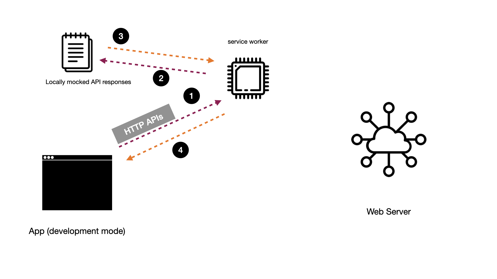
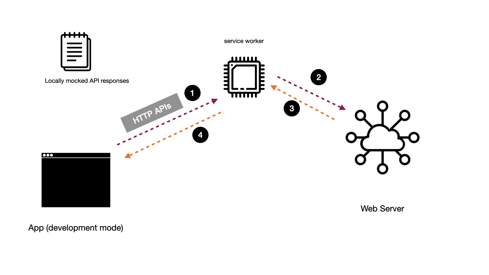
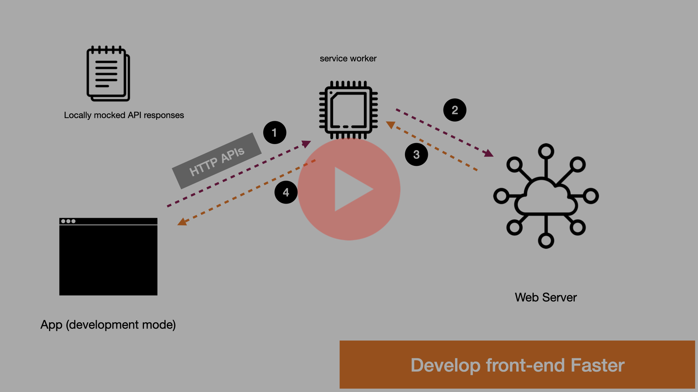

# Rapid Front-end Development

## Goal

It is very common in a web-development lifecycle to work on a feature that touches the full-stack - database, backend
logic, backend APIs, front-end logic, front-end views. Often times, a feature is scoped in the same sprint (a duration
of a feature conception to completion). This presents challenges related to work parallelization. Most times the teams
are divided functionally - front-end, backend, and therefore front-end team has dependency until backend team has
finished the work and published an API.

The goal of this project is to demonstrate that the work can happen in parallel as long as the API contract, or the
hand-off between the front-end and backend team is put in place.

## The Idea

Once the API contract is defined mocked data (realistic to business domain) is created and used by the front-end team to
kick off their work. For simplicity, HTTP GET requests are demonstrated in this codebase because of 2 reasons

1. Any project has most HTTP GET requests to make than HTTP POST/PUT/DELETE commands
2. It takes of the burden in this demo to set up a database server to store the information (those can be mocked too,
   however)

The main idea is that when developing the feature the project workflow will be following

In this workflow, no calls are made to the server. There is no point because the server team is working on creating the
API infrastructure. However, this ***does not block*** front-end team to make progress. When both teams are done with
their work, the API workflow could be tested using the following workflow

This approach helps both teams make progress in the same sprint.

## How is it achieved?

This project captures the requests at the network level by
leveraging [Service Worker API](https://developer.mozilla.org/en-US/docs/Web/API/Service_Worker_API). Specifically, this
project utilizes [Mock Service Worker (MSW)](https://mswjs.io/). The best part fo this integration is that you still
make the same API calls as you would in production, however, depending on which environment you are in, the responses
will be either mocked or **real**. You can capture the HTTP requests and debug them if you like.

You can watch the demo on YouTube by clicking on the following link

## Technologies Used

1. ReactJS with TypeScript, for entire development
2. Jest for testing
3. Mock Service Worker, for API level interception
4. Vercel for deploying front-end (this project) and backend (production APIs). The backend codebase is available
   separately at [GitHub](https://github.com/hhimanshu/businesses) and it contains the APIs listed on Vercel.
5. React-Query for fetching HTTP APIs
6. Chakra-UI for UI components

## Project Structure

`api/`

- contains HTTP APIs that the project will call. It also contains a utility `constants.ts` that is responsible for 2
  things
    * Abstracting API endpoints and routes from rest of the codebase
    * Identifying environment to return the right URL when asked for

`components/`

- contains all views that a user would be looking in the app. The goal should be send them data so that they only work
  on presentation aspects of the system

`containers/`

- responsible for connecting data (calling fetch, data massaging) with views (`/components`).

`mocks/`

- contains the mocked data based on the API contract decided with the backend team
- contains handlers that are functions that return mocked data when serviceworker asks for. You can learn more about the
  handlers at [official documentation of MSW](https://mswjs.io/docs/basics/request-handler)

`shared/`

- contains `lib/types.ts` that contains domain models to be used with in the application.
- contains helper functions that are useful for the application

`stories/`

- contains storybook integration, but no work was done in this regard for this goal.

## How to run?

- Clone this repository
- Run `npm install` to install necessary dependencies
- Run `npm start` to start development server. This will make all API requests against mocked data. Follow steps shown
  in YouTube demo for confirmation
- Run `npm run test:watch` to run Jest tests in watch mode
- Run `npm run build` to create a production build in `dist/` directory
- Run `npm run prod`. This runs the production build against the production API, which is currently based on
  other [GitHub repo](https://github.com/hhimanshu/businesses). You can change this URL
  at [constant.ts](src/api/constants.ts)

